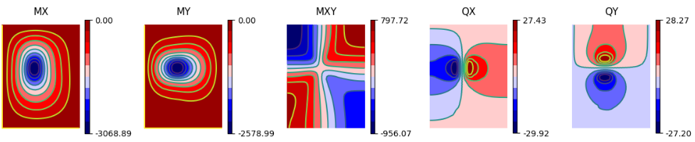

====================================================================================================
**SigmaEpsilon.Solid.Fourier** - Fourier solutions of some plate and beam bending problems in Python
====================================================================================================

.. toctree::
   :maxdepth: 1
   :hidden:

   getting_started
   User Guide <user_guide>
   Gallery <examples_gallery>
   API Reference <api>
   Development <development>

**Version**: |version|

**Useful links**:
:doc:`getting_started` |
:doc:`user_guide` |
:doc:`examples_gallery` |
:ref:`API Reference` |
`Source Repository <https://github.com/sigma-epsilon/sigmaepsilon.solid.fourier>`_

.. _sigmaepsilon.solid.fourier: https://sigmaepsilon.solid.fourier.readthedocs.io/en/latest/
.. _Matplotlib: https://matplotlib.org/
.. _NumPy: https://numpy.org/doc/stable/index.html
.. _Numba: https://numba.pydata.org/
.. _SciPy: https://scipy.org/
.. _SymPy: https://www.sympy.org/en/index.html

.. warning::

   This project is currently in an **alpha stage**. It's important to note that the authors are 
   aware of certain areas in the documentation that require improvement. As this is an early stage 
   project, some features and functionalities might be incomplete or subject to change. We appreciate 
   your understanding and welcome any feedback to enhance the project.

The `sigmaepsilon.solid.fourier`_ library offers semi-analytic solutions to some beam and plate 
bending problems, where the boundary conditions are a-priori satisfied by careful selection of the 
approximating functions. Although the calculations only cover a handful of boundary conditions, 
when they are applicable, they are significantly faster than let say a finite element solution. 
For this reason, it is very useful for a couple of things:

* experimentation
* verification
* concept validation
* education
* publication

The implementations in the library all rely on fast and efficient algorithms provided by the goodies of
`NumPy`_, `SciPy`_ and the likes. Where necessary, computationally intensive parts of the code are written
using `Numba`_.

Highlights
==========

* Semi-analytic, Navier solutions of beam and plate problems.
* Easy to use, high level interface to define various kinds of loads.
* Support for arbitrary loads using Monte-Carlo based coefficient determination.
* Industry-grade performance based on highly parallel, performant code.
* Tight integration with popular Python libraries like NumPy, SciPy, xarray, etc.
* A gallery of examples for plotting with Matplotlib for all types of problems.
* A collection of downloadable Jupyter Notebooks ready for execution covering all available functionality.
* Getting Started, User Guide and API Reference in the documentation.
* The library is intensively tested on CircleCI and has a high coverage level.

Installation
============

You can install the project from PyPI with `pip`:

.. code-block:: shell

   $ pip install sigmaepsilon.solid.fourier

If want to execute on the GPU, you need to manually install the necessary requirements. 
Numba is a direct dependency, so even in this case you have to care about having the prover
version of the cuda toolkit installed. For this, you need to know the version of the cuda
compute engine, which depends on the version of GPU card you are having.

Contents
========

.. grid:: 2
    
    .. grid-item-card::
        :img-top: ../source/_static/index-images/getting_started.svg

        Getting Started
        ^^^^^^^^^^^^^^^

        The getting started guide contains a basic introduction to the main concepts 
        through simple examples.

        +++

        .. button-ref:: getting_started
            :expand:
            :color: secondary
            :click-parent:

            Get me started

    .. grid-item-card::
        :img-top: ../source/_static/index-images/user_guide.svg

        User Guide
        ^^^^^^^^^^

        The user guide provides a more detailed walkthrough of the library, touching 
        the key features with useful background information and explanation.

        +++

        .. button-ref:: user_guide
            :expand:
            :color: secondary
            :click-parent:

            To the user guide

    .. grid-item-card::
        :img-top: ../source/_static/index-images/api.svg

        API Reference
        ^^^^^^^^^^^^^

        The reference guide contains a detailed description of the functions,
        modules, and objects included in the library. The reference describes how the
        methods work and which parameters can be used. It assumes that you have an
        understanding of the key concepts.

        +++

        .. button-ref:: api
            :expand:
            :color: secondary
            :click-parent:

            To the reference guide

    .. grid-item-card::
        :img-top: ../source/_static/index-images/gallery.svg

        Examples Gallery
        ^^^^^^^^^^^^^^^^

        A gallery of examples that illustrate uses cases that involve some
        kind of visualization.

        +++

        .. button-ref:: examples_gallery
            :expand:
            :color: secondary
            :click-parent:

            To the examples gallery
   

Indices and tables
==================

* :ref:`genindex`
* :ref:`modindex`
* :ref:`search`

