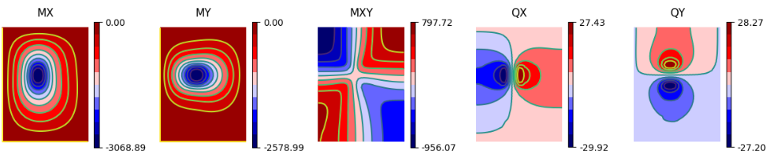
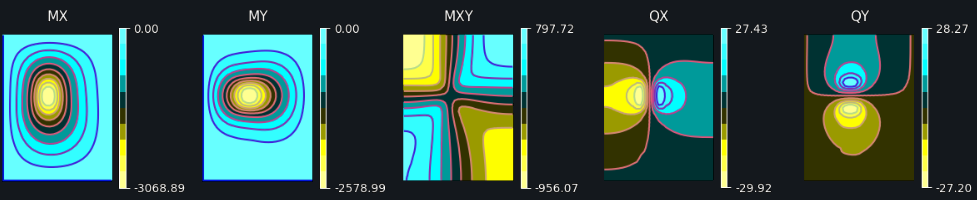

============================================================================================
**SigmaEpsilon.Solid.Fourier** – Fourier Solutions for Plate and Beam Problems in Python
============================================================================================

.. toctree::
   :maxdepth: 1
   :hidden:

   User Guide <user_guide>
   Theory Guide <theory_guide/index>
   Gallery <examples_gallery>
   API Reference <api>
   Development <development>

**Version**: |version|

**Useful links**:
:doc:`Installation <user_guide/installation>` |
:ref:`Getting Started <getting_started>` |
`Issue Tracker <https://github.com/sigma-epsilon/sigmaepsilon.solid.fourier/issues>`_ | 
`Source Repository <https://github.com/sigma-epsilon/sigmaepsilon.solid.fourier>`_ | 
:doc:`Bibliography <bibliography>`

.. include:: global_refs.rst

The `sigmaepsilon.solid.fourier`_ library provides semi-analytical solutions for selected beam and plate bending problems, where boundary conditions are inherently satisfied through the careful choice of approximating functions. While the available solutions cover only a limited set of boundary conditions, they are significantly faster than, for example, finite element methods when applicable. This makes the library especially valuable for:

* Experimentation
* Verification
* Concept validation
* Education
* Publication

All implementations leverage the speed and efficiency of libraries such as `NumPy`_ and `SciPy`_, with performance-critical code sections accelerated using `Numba`_ where needed.

.. _highlights:

Highlights
==========

.. include:: highlights.rst

Contents
========

.. grid:: 2
    
    .. grid-item-card::
        :img-top: ../source/_static/index-images/getting_started.svg

        Getting Started
        ^^^^^^^^^^^^^^^

        Start here to set up your development environment and take your first steps with the library.

        +++

        .. button-ref:: user_guide/index
            :expand:
            :color: secondary
            :click-parent:

            Get me started

    .. grid-item-card::
        :img-top: ../source/_static/index-images/user_guide.svg

        User Guide
        ^^^^^^^^^^

        Explore the user guide for a comprehensive walkthrough of the library’s main features, with helpful background and explanations.

        +++

        .. button-ref:: user_guide
            :expand:
            :color: secondary
            :click-parent:

            To the user guide

    .. grid-item-card::
        :img-top: ../source/_static/index-images/api.svg

        API Reference
        ^^^^^^^^^^^^^

        The reference guide details all functions, modules, and objects in the library, explaining their usage and parameters. Some familiarity with the core concepts is assumed.

        +++

        .. button-ref:: api
            :expand:
            :color: secondary
            :click-parent:

            To the reference guide

    .. grid-item-card::
        :img-top: ../source/_static/index-images/contributor.svg

        Contributor’s Guide
        ^^^^^^^^^^^^^^^^^^^

        Interested in contributing? The guidelines will walk you through the process of improving the library.

        +++

        .. button-ref:: development_guide
            :expand:
            :color: secondary
            :click-parent:

            To the contributor's guide
   

Indices and tables
==================

* :doc:`Bibliography <bibliography>`
* :ref:`genindex`
* :ref:`modindex`
* :ref:`search`
