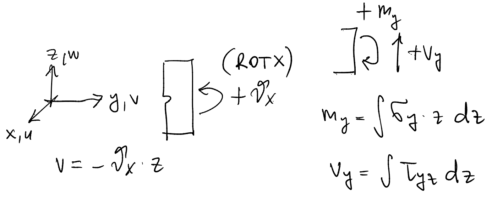
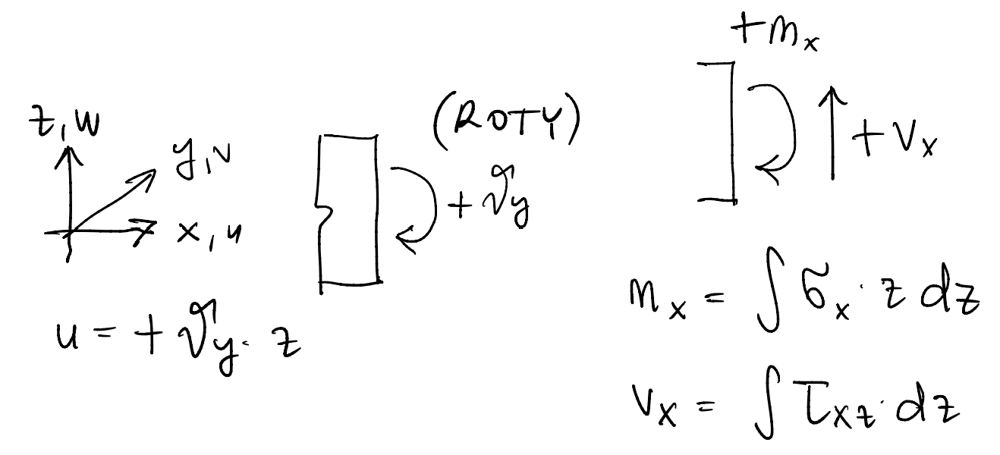
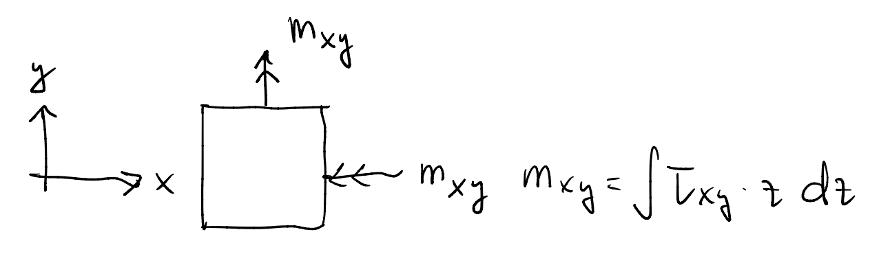

.. _theory_guide:

============
Theory Guide
============

.. note::
   This page is under construction. 

The theory guide provides a detailed explanation of the underlying theory
and assumptions used in the library.

.. _sign_conventions:

Sign conventions
================

It is crucial to understand the sign conventions used in the library in order 
to interpret the results accurately. This theory guide is not intended to serve 
as a comprehensive course on the subject. Instead, its primary purpose is to 
provide sufficient information for you to input data correctly and interpret 
the results. For those interested in further exploration, we have included 
references to additional literature.

.. _beam_sign_conventions:

Sign conventions for beams
--------------------------

...

.. _plate_sign_conventions:

Sign conventions for plates
---------------------------

Bending in the XY plane

Bending in the XZ plane

Twisting

